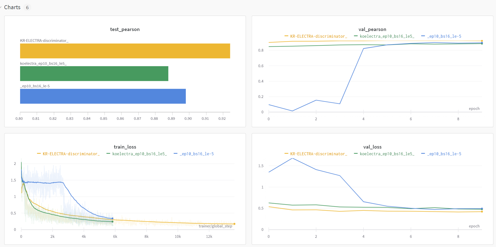

# 문장 간 유사도 측정(Semantic Text Similarity, STS)

## 레포지토리 구조

```python
level1_semantictextsimilarity-nlp-13
├─ .config
│  ├─ model_config.yaml
│  └─ sweep_config.yaml
├─ .gitignore
├─ code
│  ├─ model.py
│  ├─ train.py
│  ├─ inference.py
│  ├─ focalloss.py
│  └─ loss.py
├─ img
└─ Readme.md
```

- .config: 모델 훈련 및 예측 수행시 사용하는 yaml 파일이 저장된 디렉토리
- code: 모델 훈련 및 예측을 수행하는 코드가 담긴 디렉토리
  - model.py: Baseline 코드에서 train.py와 inference.py의 공통된 부분인 Dataset, Dataloader, Model을 모아놓은 코드
  - train.py: 모델에 대한 훈련을 수행하는 코드
  - inference.py: 저장된 모델을 사용하여 예측을 수행하는 코드
  - focalloss.py: Focalloss를 계산하는 클래스가 포함된 코드
  - loss.py: weighted_mse_loss, weighted_focal_mse_loss 등 다양한 loss 함수들이 포함된 코드
- img: Readme를 위한 이미지가 저장된 디렉토리

## 프로젝트 개요

### 프로젝트 주제

- 문장 간 유사도 Semantic Text Similarity (STS) 계산
- 목적 : 글의 퀄리티 향상
  - 보고서나 논문 등의 정보 전달 목적의 글을 쓰다보면, 같은 말을 반복해서 쓰게 되는 경우가 많음.
  - 중복된 문장들은 가독성을 떨어뜨리는 요인 중 하나로써, 글의 퀄리티가 낮아지게 만듦.

### 프로젝트 구현 내용, 컨셉, 교육 내용과의 관련성

- 자연어 처리 테스크 중 하나로, 두 개의 문장을 벡터화 한 후 유사도를 정량화하는 테스크

### 활용 장비 및 재료 (개발 환경, 협업 tool 등)

- (팀 구성 및 컴퓨팅 관경) 4인 1팀, 인당 aistages의 V100 서버를 VScode와 SSH로 연결하여 사용
- (협업 환경) Notion, Github, Wandb
- (의사 소통) 카카오톡, Zoom, Slack, 대면

### 프로젝트 구조 및 사용 데이터셋의 구조도

- **input :** 두 개의 문장과 ID, 유사도 정보가 담긴 CSV 파일
- **output** : 평가데이터에 있는 각 문장쌍에 대한 ID와 유사도 점수가 담긴 CSV 파일
- 학습 데이터셋 9,324개, 검증 데이터셋 550개, 평가 데이터는 1,100개가 제공
- 유사도 점수는 0~5 사이의 실수로 제공되며 각 데이터별 점수는 여러명의 사람이 위의 점수 기준을 토대로 평가한 두 문장간의 점수를 평균낸 값임.
- 데이터 출처
  - 국민청원 게시판 제목 데이터, 네이버 영화 감성 분석 코퍼스, 업스테이지(Upstage) 슬랙 데이터
- 평가 데이터의 50%는 Public 점수 계산에 활용되어 실시간 리더보드에 표기, 남은 50%는 Private 결과 계산에 활용되어 대회 종료 후 평가

## 프로젝트 팀 구성 및 역할

| 이름 | 역할 |
| --- | --- |
| 김민호 | Loss function 실험, 모델 디버깅 |
| 박희진 | EDA, Data augmentation, 모델 성능 실험 |
| 천소영 | Model 리서치, 모델 성능 실험, Auxilary loss 적용, LR scheduler서치 |
| 홍영훈 | EDA, Data augmentation, source 정보 활용 |
| 전체 | Wandb 연동, Error case analysis, 실험 table작성, wrap up report 작성 |

## 프로젝트 수행 절차 및 방법

### 팀 목표 설정

1주차) 강의 수강 완료 후 스페셜 미션 시행

2주차) 리더보드상의 Public Pearson Correlation Coefficient값 0.9 이상

### 프로젝트 진행

1. 프로젝트 개발환경 구축 (Github, Slack, WandB, Server)
2. EDA를 진행하며 프로직트와 데이터의 구조를 파악하고 의미를 분석
3. 데이터 분포 분석을 통한 데이터 증강
4. 다양한 모델의 적용을 통한 비교 분석
5. 과제에 적합한 loss함수 서치 및 적용

## 프로젝트 수행 결과

### 결과

- Public 14등, pearson 0.909

<p align="center">

<p>

- Private 13등, pearson 0.9287

<p align="center">

<p>

### 수행한 실험 목록

| 텍스트 | 태그 | val_pearson | 모델 | loss func | batch size | lr scheduler |
| --- | --- | --- | --- | --- | --- | --- |
| Baseline code |  | 0.8981 | klue/roberta-base | l1 | 16 | x |
| Baseline code_epoch20 | epoch | 0.9078 | klue/roberta-base | l1 | 16 | x |
| Baseline code_epoch40 | epoch | 0.9109 | klue/roberta-base | l1 | 16 | x |
| batch size 32 | batch | 0.8939 | klue/roberta-base | l1 | 32 | x |
| Huber, LambdaLR | loss,Lr Scheduler | 0.9116 | klue/roberta-base | HuberLoss | 16 | LambdaLR |
| weighted_focal_l1_loss, LambdaLR | loss,Lr Scheduler | 0.9211 | klue/roberta-base | weighted_focal_l1_loss | 16 | LambdaLR |
| Huber loss, klue/roberta-large, LambdaLR | loss,Model,Lr Scheduler | 0.9297 | klue/roberta-large | HuberLoss | 8 | LambdaLR |
| KoBert | Model | 0 | skt/kobert-base-v1 |  |  |  |
| monologg/koelectra-base-discriminator | Model | 0.8877 | monologg/koelectra-base-discriminator |  |  | x |
| Auxiliary loss (7 : 3) | loss | 0.905 |  |  |  |  |
| Auxiliary loss (9 : 1) | loss | 0.2 |  |  |  |  |
| source | data,epoch | 0.915 | klue/roberta-base | huber | 32 | x |

### 가설과 검증

**01. 데이터 분석**

- 가설 : 데이터의 분포를 보니 유사도가 0에서 0.5 사이의 분포가 많았음. 데이터 불균형으로 인한 문제가 발생하지 않을까 생각하여, 유사도가 0에서 0.5인 부분의 데이터를 일부만 활용하여 최대한 균형있는 데이터를 만들면 좀 더 좋은 학습이 될 것이라 예상.
  - 검증 : 코드는 모두 기존 baseline 코드를 활용하고 데이터만 다르게 했을 때 검증 set에 대한 pearson 점수가 변경 전이 변경 후보다 높아 dataset을 바꾸지 않는 것으로 결정.

- 가설 : 예측 결과를 보니 문장들을 봤을 때 앞부분이 비슷하면 모델이 정답값보다 좀 더 높게 측정하고 앞부분이 다르면 모델이 좀 더 낮은 점수를 준다고 생각함. 문장 순서를 뒤집은 데이터를 추가해서 모델에 넣으면 이러한 부분이 해소될 것으로 예상.
  - ex) ‘나는 밥을 먹는다’ ⇒ ‘먹는다 밥을 나는’
  - 검증 : 문장 순서를 뒤집은 데이터를 추가해서 모델에 넣은 결과 pearson 점수가 기존 데이터만을 활용했을 때 보다 더 낮아졌음.
- 가설 : 위와 같은 의미로 어순이 바뀌어도 의미가 같은 경우가 많아 기존 데이터에 30% 정도 무작위로 순서를 바꿔 데이터셋 구성
  - ex) 어순이 바뀌어도 의미가 같은 경우가 많다. → 의미가 같은 경우가 많다. 어순이 바뀌어도
  - 검증 : 문장 순서를 무작위로 바꾼 데이터를 추가했을 때 pearson 점수가 더 낮아졌음.
- 가설: 데이터를 영어로 번역한 뒤 다시 한국어로 번역하여 활용하면 문장의 의미를 유지한 상태로 다른 단어로 구성된 유사한 문장으로 재구성할 수 있어 구글 번역 api를 이용한 역번역한 데이터를 추가함.
  - ex) “뿌듯뿌듯 하네요!!” → “I'm so proud!!” → “정말 자랑스럽습니다!!”
  - 검증: 데이터 이외의 조건은 모두 동일한 조건일 때, 원본 데이터에 비해 역번역까지 추가한 데이터를 사용했을 때 pearson 점수가 낮아져 더 질 좋은 번역 api를 사용 고려

    <p align="center">
    
    <p>

    주황색: 원본 데이터, 하늘색: 역번역까지 추가한 데이터

- 가설 : train set과 dev set의 분포를 보면 출처에 따라 유사도의 분포가 확연히 차이나는 것을 확인. 그래서 출처 정보를 활용하면 어떨까라는 생각이 들어서 기존 문장 정보만 활용해서 얻은 hidden state vector 10개와 source 문장에 대한 vector를 1개 만들어서 최종적으로 이 11개를 활용하여 선형 층을 쌓아 문장 유사도를 추출해 봄
- 가설 : train set과 dev set의 분포를 보면 출처에 따라 유사도의 분포가 확연히 차이나는 것을 확인. 그래서 출처 정보를 활용하면 어떨까라는 생각이 들어서 기존 문장 정보만 활용해서 얻은 hidden state vector 10개와 source 문장에 대한 vector를 1개 만들어서 최종적으로 이 11개를 활용하여 선형 층을 쌓아 문장 유사도를 추출해 봄
  - 검증 : 같은 모델(baseline + hubber) 로 기존 데이터셋을 활용했을 때 val_pearson : 0.9154가 나왔었는데 source 정보를 같이 추가한 0.915 정보가 나와서 거의 비슷한 성능을 보임.

**02. Loss 함수 다양화**

- MSE 적용
  - 가설 : pearson은 분산값이 중요하여 하나의 값이 튀면 값이 잘 안나오는 경향이 있음. 그래서 MSE를 적용했을 때 높은 pearson 값을 예상함
  - 검증 : MSE를 적용했을 때 pearson 점수는 0.87 정도로 L1 loss를 적용했을 때 보다 더 낮은 값이 나왔음. 그래서 MSE만 단순 적용하는 것은 잘 맞지 않는다고 생각. 아마 예측값이 0~5 사이인데, MSE 특성상 0에서 1 사이의 loss는 MAE 보다 낮게 측정되어 그런 것이 아닌가 생각.

- Huber loss 적용
  - torch.nn.HuberLoss()
  - 가설 : L1 Loss는 이상치에 robust하지만 특정 지점에서 미분이 불가능하고, 평균이 아닌 중앙치를 사용하는 단점이 있음. L2 Loss는 모든 지점에서 미분 가능하지만 이상치에 robust하지 못한다는 단점이 있음. Huber loss는 특정 지점 이후는 L1 Loss를, 이전은 L2 Loss를 활용한 손실함수로, 두 손실함수의 장점만을 채택함. 따라서 이 Huber Loss를 사용하면 이상치에 robust 하면서도 모든 지점에서 미분 가능해 효율적인 손실 측정이 가능하여 성능을 향상시킬 수 있을 것임.
  - 검증: Loss 값이 높은 지점에서는 L1 Loss를 사용하기에 이상치에 robust한 특성이 적용되어 안정적으로 작은 Loss를 향해 수렴하는 모습 확인 가능. Loss 값이 작은 지점에서는 L2 Loss를 사용하기에 모든 지점에서 미분 가능하다는 특성이 적용되어 기존 L1 Loss만을 사용했을 때 train_loss가 0.2근방으로 수렴하던 반면, Huber Loss를 사용한 경우에는 0.02 근방으로 수렴하는 것을 볼 수 있었음. Val_pearson의 경우에도 기본 코드에서 epoch을 40번 수행했을 때 0.9109가 나온 반면, Huber loss를 사용하였더니 0.9154가 측정되어 Huber loss가 성능을 향상시켰음을 확인.

- Auxiliary loss 적용
  - 가설: 현재 float로 예측 되는 값에 더하여, 0에서 2.5점수까지는 유사도 class 0, 2.5에서 5 점수까지는 유사도 class 1로 예측하는 loss를 추가한다면 실수 값의 예측이 명시되는 효과를 기대하였음.
  - BCE loss를 기존의 loss와 weighted sum 방식으로 사용함.
    - loss = w*L1_loss + (1-w)*BCE_loss
    - w의 비율을 바꿔 가며 최적의 w값을 찾는 실험 진행

    <p align="center">
    
    <p>

  - 검증: 성능이 크게 개선되지는 않았음. 다만 loss가 빠르게 감소하는 학습 곡선을 보임을 확인 가능하였음.

- Weighted focal loss 적용
  - 가설: 현재 주어진 train.csv는 label의 분포가 0쪽으로 치우쳐 있는 상태이다. Focal Loss는 분류 문제에서 사용하는 Cross Entropy Loss가 Imbalanced Dataset에 취약하다는 점에서 등장한 손실 함수임. 이를 Regression 문제에 적용하여 구현한 weighted_focal_l1_loss, weighted_focal_huber_loss를 사용하면 Undersampling으로 원본 데이터의 손상을 주지 않은 불균형 데이터에 대해서도 학습을 잘 수행할 수 있을 것임.
  - 검증: valid 데이터를 통해 예측한 점수와 label을 비교하였더니, 기존의 방식에서 틀렸던 문제와는 다른 문제에 대해 틀리는 것을 확인할 수 있었음. 즉, 불균형한 데이터로 학습하는 데 robust하다는 특징을 확인할 수 있었음. Val_pearson의 경우에도, 단순 L1 Loss는 0.915지만 weighted focal l1 loss는 0.9211이었고, 단순 Huber loss는 0.9154지만 weigted focal huber loss는 0.9233으로, weighted focal loss가 성능 향상을 이끌어냈다는 것을 확인함.

**03. Model 변경**

- klue/roberta-small, klue/roberta-base, klue/roberta-large
- koelectra, KR-ELECTRA 모델 사용
  - 가설 : 학습 데이터 셋에 slack 대화 데이터 등의 구어체 대화가 포함되어 있다는 데이터 분석 결과를 바탕으로, 구어를 중심으로 학습한 모델인 KoELECTRA-v3를 사용함.
  - Hugging face 검색, 적용 ( Github: [monologg](https://github.com/monologg/KoELECTRA), snunlp)
  - 동일 조건으로 basline 모델과의 실험 진행

    <p align="center">
    
    <p>

  - 결과: KR-ELECTRA의 성능이 높음을 확인함.

**04. Learning rate scheduler 사용**

- LambdaLR 적용
  - 0.95 ** epoch
  - 가설 : 학습이 진행됨에 따라서 LR이 감소하는 추세를 적용, 안정적으로 학습을 가능하도록 스케줄링하기 위해 LambdaLR을 적용

**05. Post processing**

- Output 값 범위 조정
  - 결과 값이 -0.1이나 5.2 등 주어진 정답 범위를 넘어가는 값 확인, 소수의 결과만 이 양상을 보여 후처리를 통해 0~5값으로 범위 제한

- Weighted Voting
  - 가설: L1 Loss나 Huber Loss를 사용해 학습한 모델이 틀리는 문제와, weighted focal loss를 사용해 학습만 모델이 틀리는 문제의 유형이 다르다는 것을 확인함. 두 모델의 출력을 weighted voting을 통해 평균내 최종 출력으로 사용하여 제출하면 점수가 더 높게 나올 것임.
  - 검증: Huber Loss를 사용한 Public pearson은 0.8957이었고, weigted focal huber loss는 0.8923이었음. Huber Loss, weighted focal l1 loss, weigted focal huber loss 세 가지를 weighted sum을 통해 만든 출력값은 0.9097로, Weighted Voting이 효과가 있다는 것을 확인함.

## 5. 자체 평가 의견

### 잘했던 점

- 데이터, model, loss 등 각각의 개선 방향에 대한 다양한 시도
- 목표했던 Public pearson 0.9 달성 성공

### 시도 했으나 잘 되지 않았던 점

- Data augmentation이 성능 증가로 이어지지 않음

### 아쉬웠던 점

- EDA를 충분히 하지 않고, 프로젝트 진행
- 문장의 tokenizer 적용 결과를 확인을 충분히 하지 않음([UNK] 토큰 확인 등)
- Wandb 사용법이 익숙치 않아 프로젝트 별 관리 아쉬움
- 가설 검증 단계에서 성능으로만 개선 여부를 확인하여, 어느 부분이 개선이 되었는지 예측값이 어떻게 달라졌는지 label 별로 자세히 살펴보지 못함
- SMART 논문을 적용하지 못함

### 다음에 시도해보고 싶은 점

- 정규식 활용한 데이터 전처리 (특수문자, ‘ㅋㅋ’,’ㅎㅎ’ 등 제거)
- 모델 앙상블
- 하이퍼 파라미터 및 성능 비교 시 train 데이터 shuffle의 random seed를 고정해 비교
- 부스팅
- 시도한 기법들을 다양하게 조합하여 여러 실험을 하는 것

### 프로젝트를 통해 배운 점

- EDA의 중요성
- VScode로 서버 연결
- Github 협업 방법
- Wandb 연동 및 sweep 적용
